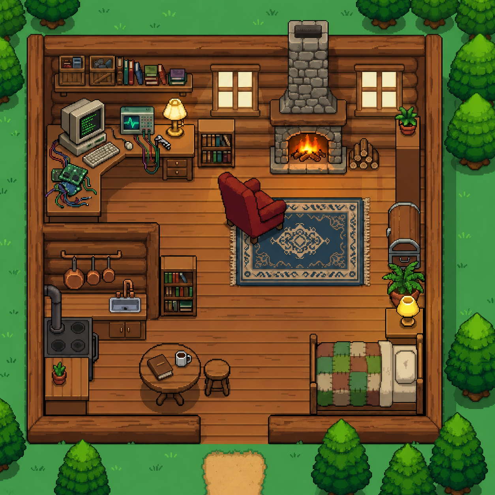
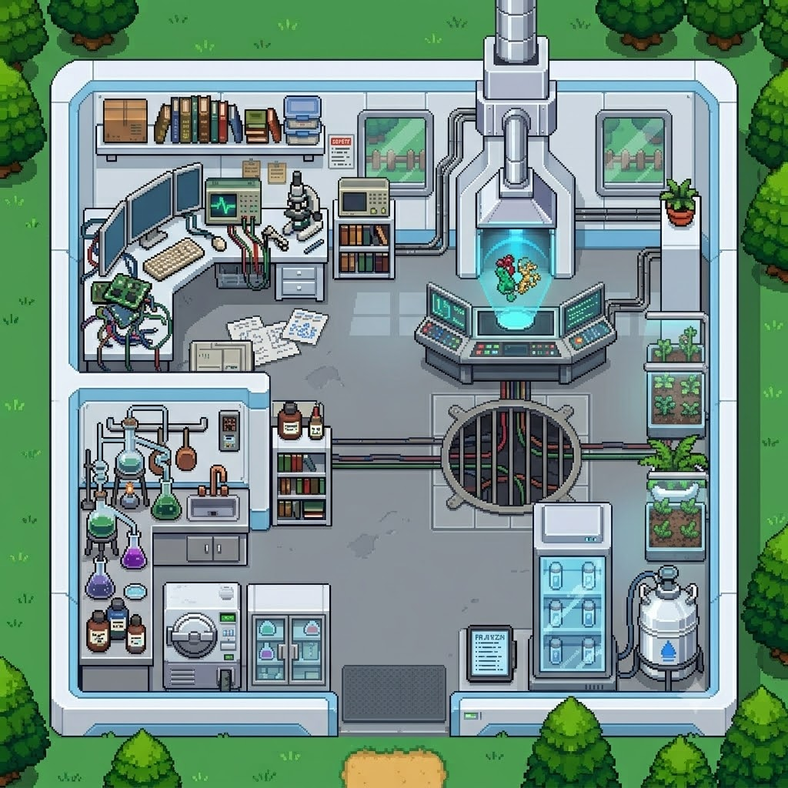
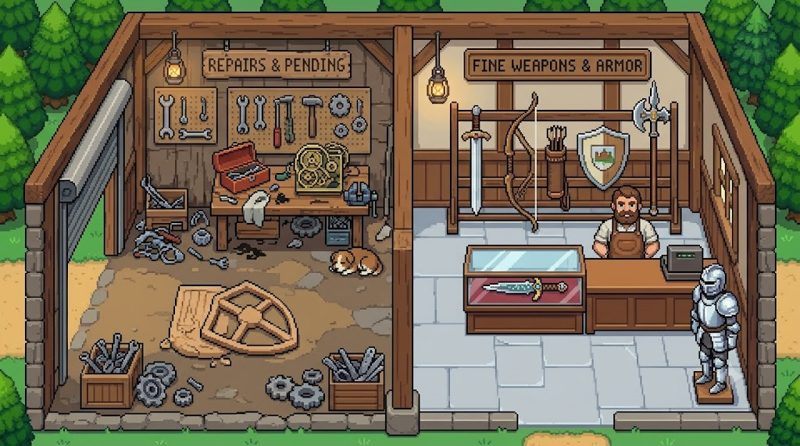
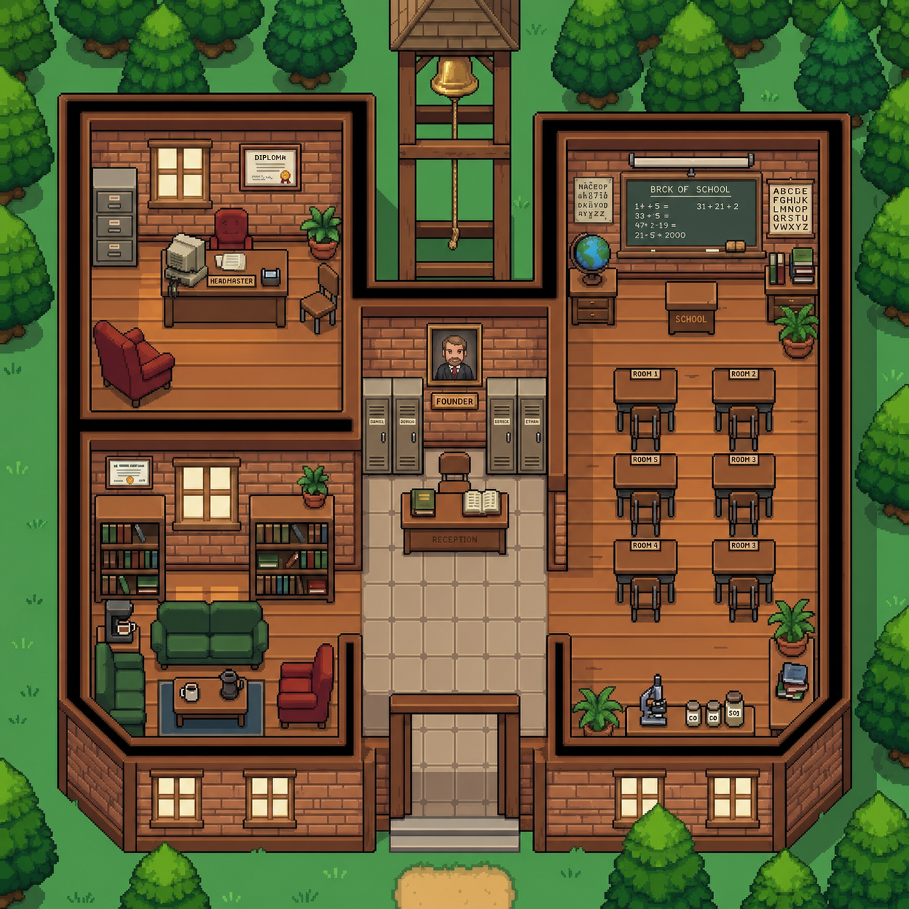
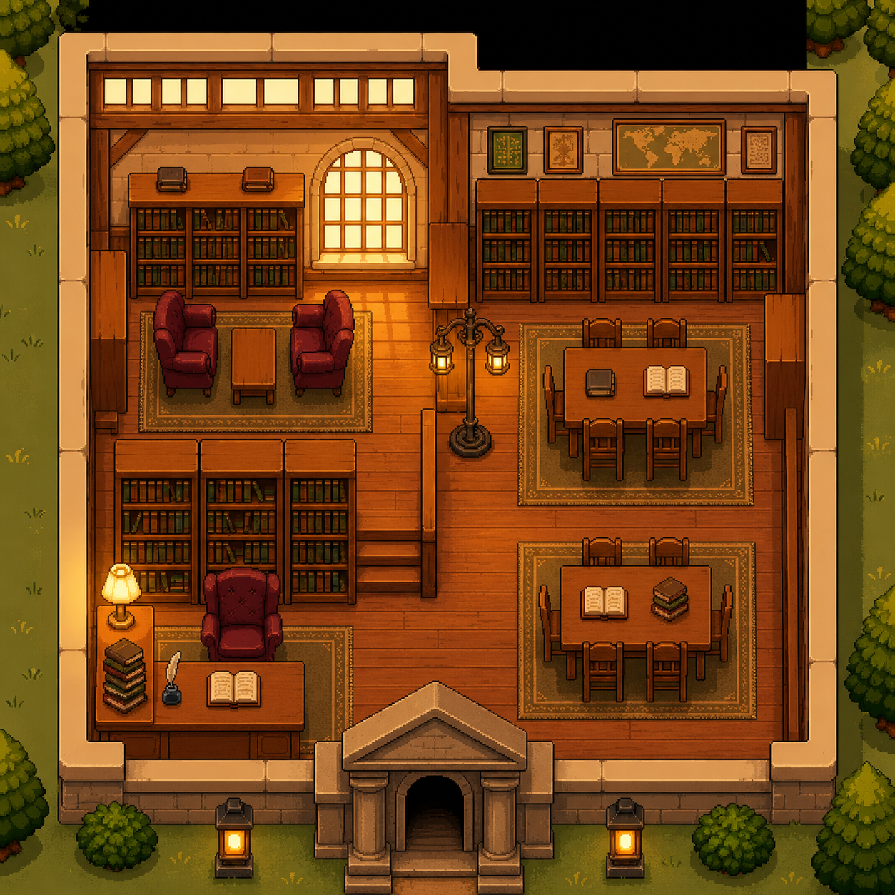
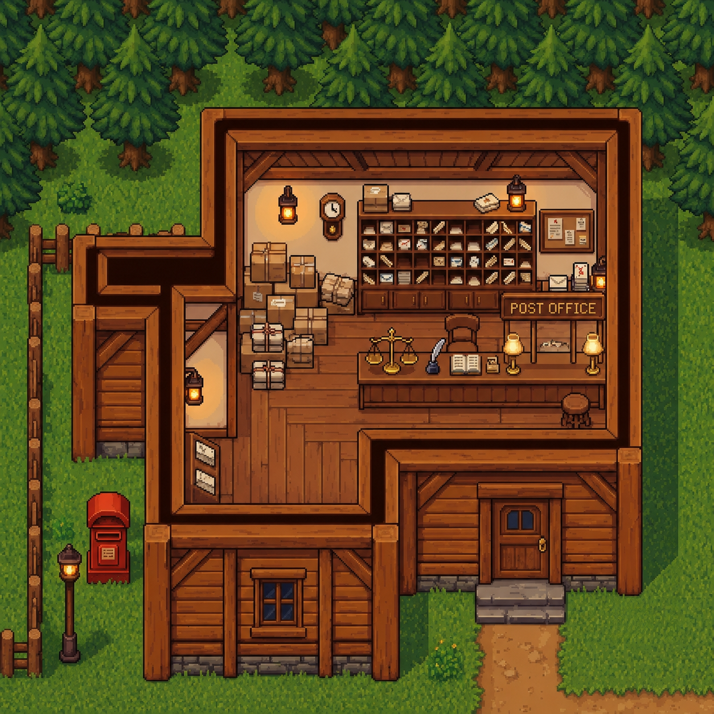

<div align="center">

# QuestFolio 🗡️📜

**A browser-based 2D pixel-art RPG that doubles as an interactive developer portfolio.**

[](https://ravikantiakshay.github.io/QuestFolio/)
[](https://github.com/RavikantiAkshay/QuestFolio)

*Explore a handcrafted world. Enter buildings. Discover a developer's journey through interactive interiors — typewriters, retro Sitcom TV monitor, CRT workstations, chalkboards, skill bookshelves, blueprints, sealed letters, and a page-flippable travel diary.*

---

</div>

## 🌟 Overview

**QuestFolio** is a top-down pixel-art RPG built entirely in the browser using vanilla HTML5, CSS3, and JavaScript — no external game engines or heavy bundlers. You control an animated adventurer exploring an interconnected world filled with villages, a school campus, and a dark castle.

Every building you enter opens a custom-designed interactive experience:
- 🏡 **Home**: Personal intro on a vintage typewriter, Sitcom OS retro TV, and a realistic Travel Diary.
- 🧪 **Lab Workstation**: Multi-device terminal (Tablet, Monitor, Phone) to view live projects and gamified bounties.
- 🛠️ **Workshop**: Architectural drafting table displaying project blueprints, and a fully functional interactive Armory shop with a dynamic coin-based economy for purchasing weapons.
- 🏫 **School**: Animated chalkboard displaying an education timeline from Class X through B.Tech at IIT Bhilai.
- 📚 **Library**: Floor-to-ceiling wooden racks showcasing technical skills categorized into 6 technology shelves.
- ✉️ **Post Office**: Kraft envelope with a wax seal, airmail borders, paperclip, and direct contact directory.
- 🗺️ **Town Map Stand**: Physical wooden parchment map stand with proximity-based interactive viewing.
- 🏰 **Castle & Boss Fight**: Multi-phase boss battle with attack combos, defense stance, warning spikes, and fire walls.

---

## 🎮 Controls

| Key / Input | Action |
|:---:|:-------|
| `W` `A` `S` `D` / `Arrow Keys` | Move Character |
| `E` | Interact with Buildings / NPCs / Map Stand |
| `ESC` | Close Active Overlay / Return to Overworld |
| `Left Click` | Attack (3-hit combo sequence) |
| `F` | Defend Stance (Block incoming damage) |
| `U` | Toggle Workshop Armory Shop (When inside Workshop) |
| `N` | Cycle Time of Day (*Day ➔ Evening ➔ Night ➔ Early Morning*) |
| `M` | Cycle Season (*Summer ➔ Monsoon ➔ Autumn ➔ Winter*) |

---

## 🗺️ The World & Landmarks

The game world features three distinct zones, each with dedicated tilesets, collision maps, NPCs, and interactive buildings:

### 1. Town Village (The Starting Hub)
- **Home**: A cozy log cabin containing:
  - **Typewriter**: A mechanical typewriter holding a personal introduction sheet.
  - **Sitcom OS (Retro TV)**: An 80s CRT television featuring developer "Sitcom DNA" and a corkboard of developer quotes styled as sticky notes from popular sitcoms (*Modern Family, B99, Parks & Rec, Friends, The Middle, Community*).
  - **Travel Diary**: A realistic 3D page-flippable book showcasing travel statistics, trip histories, and Leaflet.js interactive maps.
- **Lab Workstation**: A high-tech research station featuring a Tablet (description/features), PC Monitor (project preview & navigation), and Phone (tech stack, repository links, and active bounties).
- **Workshop**: A blacksmith forge turned drafting table lined with drafting tools displaying project blueprints. Features an interactive Armory hotspot where you can spend collected coins to unlock new weapons (like the AK-47).
- **Town Map Stand**: An outdoor wooden display board nailed with an aged parchment mini-map. Proximity prompts appear when standing nearby (`Press E to open Map`).

### 2. School Campus
- **School Classroom**: Features a wooden-framed green chalkboard with sliding chalk slides detailing an academic timeline from Class X to B.Tech at IIT Bhilai.
- **Library**: Grand library hall with dual wooden book racks categorized across 6 domain shelves (*Languages, Frontend, Backend, Databases, Tools & DevOps, AI & Cloud*).
- **Post Office**: An L-shaped postal desk displaying an open kraft airmail envelope, a wax seal stamped "A", and a fully visible contact letter.

### 3. Castle & Boss Arena
- **Fortress Grounds**: Home to the final Boss encounter with custom dialogue sequences, phase transitions, and unique combat mechanics.

---

## 🖼️ Handcrafted Interiors

Every building features a 3/4 orthographic cutaway interior view with togglable "Explore" and "Return to Town" overlay controls.

<table>
  <tr>
    <td align="center"><b>Home Interior</b><br></td>
    <td align="center"><b>Lab Workstation</b><br></td>
    <td align="center"><b>Workshop Blueprint Table</b><br></td>
  </tr>
  <tr>
    <td align="center"><b>School Classroom</b><br></td>
    <td align="center"><b>Library Book Racks</b><br></td>
    <td align="center"><b>Post Office Desk</b><br></td>
  </tr>
</table>

---

## ⚔️ Combat & Economy System

- **Melee & Ranged Combat**: Execute a 3-hit melee combo, or purchase and equip ranged weapons like the AK-47 from the Armory to fire projectiles.
- **Coin Economy**: Defeating NPCs causes them to drop coins. Collect these dropped coins to build your wealth and purchase upgrades.
- **Shield Defend**: Hold `F` to enter a defensive stance, reducing incoming damage from enemy attacks.
- **Visual Feedback**: Screen shake effects on heavy impacts, red damage flash overlay, and dynamic health bars for player and boss.
- **Multi-Phase Boss Encounter**:
  - **Phase 1 (Spike Traps)**: Boss summons warning indicators followed by ground spikes targeting the player.
  - **Phase 2 (Flame Walls - at 70% HP)**: Triggered via cinematic dialogue transition, spawning horizontal and vertical cross-fire patterns.
- **Game Over & Victory Overlays**: Custom game state screens allowing instant restart and respawn.

---

## 🌦️ Atmospheric Weather & Day/Night Cycles

### Time of Day (`N` Key)
- ☀️ **Day**: Crisp lighting with full visibility.
- 🌅 **Evening**: Warm orange-to-purple gradient with a breathing atmospheric pulse.
- 🌙 **Night**: Deep night overlay featuring glowing emissive light sources for streetlamps, windows, and player lantern.
- 🌫️ **Early Morning**: Cool pale-blue morning mist.

### Dynamic Seasons (`M` Key)
- 🌻 **Summer**: Converging world-space god-rays fanning from the sun.
- 🌧️ **Monsoon**: Angled rain animation, expanding splash ripples, and specular puddle highlights.
- 🍂 **Autumn**: Wind-blown falling leaf particles with wobble physics *(Default)*.
- ❄️ **Winter**: Gentle snow flurry particles with horizontal drift and frosty blue overlay.

---

## 📖 Travel Diary System

Inside the Home interior, interacting with the diary hotspot opens a 3D page-flippable travel book powered by `StPageFlip` and pre-loaded local travel data:
- **Statistics Overview**: Total trips, total days traveled, Haversine-calculated total distance, unique places visited, longest/shortest journeys, and breakdown charts by year, month, and transport mode.
- **Interactive Trip Pages**: Detailed logs with dates, highlights, and embedded Leaflet.js interactive maps featuring route polylines and location markers.

---

## 🛠️ Tech Stack & Architecture

- **Core**: Vanilla JavaScript (ES6+), HTML5 Canvas, Vanilla CSS3
- **Page Flip Engine**: `StPageFlip` library
- **Mapping**: `Leaflet.js` for interactive trip maps
- **Typography**: Google Fonts (*Share Tech Mono, Permanent Marker, Special Elite, Kalam, Caveat*)
- **Data Architecture**: Pre-loaded synchronous modular data files (`mapData.js`, `tripsData.js`, collision arrays)

---

## 🚀 Running Locally

No build tools or NPM dependencies required. Simply serve the workspace folder with any static file server:

```bash
# Clone the repository
git clone https://github.com/RavikantiAkshay/QuestFolio.git
cd QuestFolio

# Start a local static server
python -m http.server 8080
# Or using Node: npx serve .
# Or open directly with VS Code Live Server extension
```

Then open `http://localhost:8080` in your web browser.

---

<div align="center">

[](mailto:ravikantiakshay15@gmail.com)
[](https://github.com/RavikantiAkshay)
[](https://linkedin.com/in/ravikanti-akshay)

<sub>Crafted with vanilla JS, pixel art, and passion.</sub>

</div>
