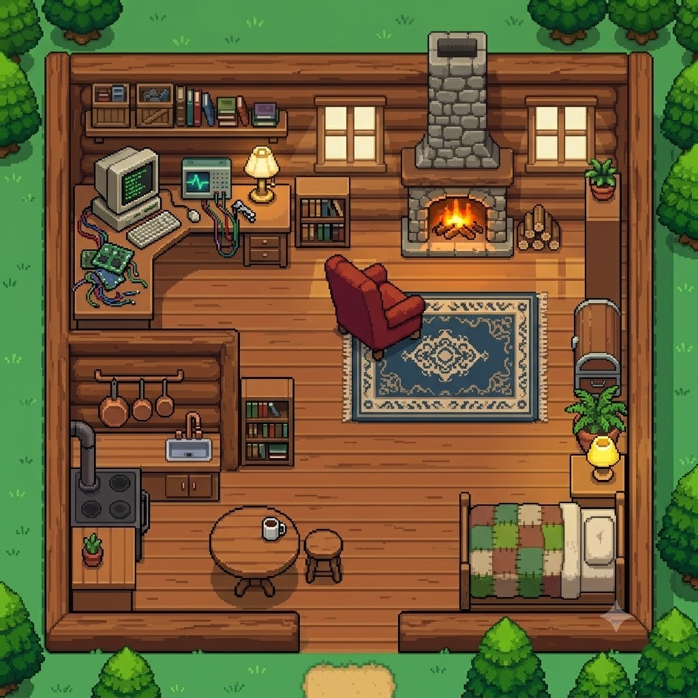
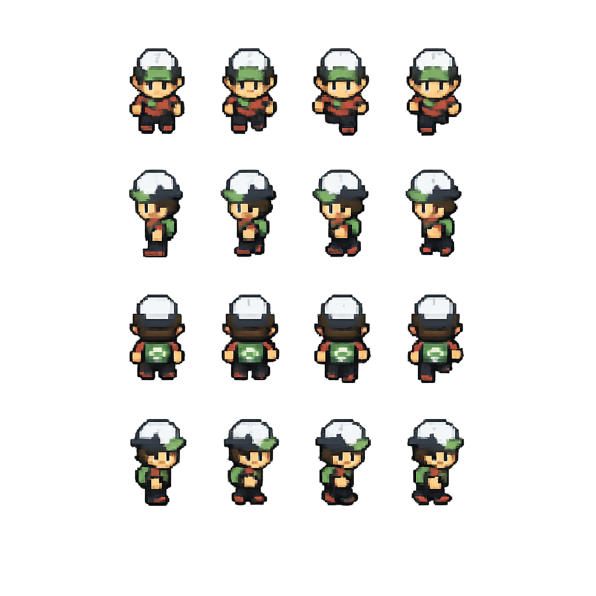
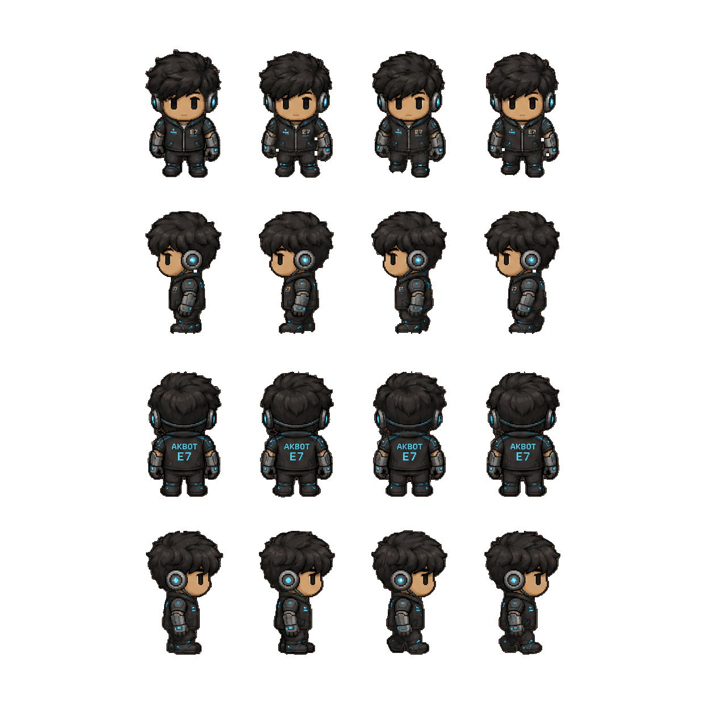

<div align="center">

# 🗡️ Oak Village — An Interactive RPG Adventure

**Explore a handcrafted pixel-art world. Discover stories hidden inside every building.**

[](https://ravikantiakshay.github.io/my-game/)
[](https://github.com/RavikantiAkshay/my-game)

*A top-down RPG experience where every building you enter reveals a chapter of a developer's journey — from the cozy Home typewriter to the Lab terminals, the Workshop blueprints, the School chalkboard, the Library bookshelves, and the Post Office mailbox.*

---

</div>

## 🌍 What Is This?

Oak Village is a **browser-based, top-down pixel-art RPG** built entirely with vanilla HTML, CSS, and JavaScript — no frameworks, no bundlers, just raw code and canvas rendering.

You control a character wandering through an interconnected world of villages, schools, and castles. But this isn't your typical RPG — every building you enter is an **interactive experience** that tells a story. The Lab boots up a CRT terminal showcasing real projects. The Library shelves are lined with skill books. The Workshop holds active blueprints and stashed concepts. The School chalkboard displays an education timeline. And the Post Office holds a personal letter with a wax seal.

It's part game, part story, part experience — and it runs entirely in your browser.

---

## 🎮 Controls

| Key | Action |
|:---:|:-------|
| `W` `A` `S` `D` / `Arrow Keys` | Move character |
| `E` | Interact with buildings / NPCs |
| `ESC` | Return to the overworld |
| `Click` | Attack (3-hit combo system) |
| `Space` | Defend |

---

## 🏘️ The World

The game world is split into **three interconnected zones**, each with its own tileset, collision data, and interactable buildings:

### 🏡 Town Zone
> *The starting village — a quiet hamlet surrounded by pine forests and winding dirt paths.*

- **Home** — Enter the cozy log cabin. A typewriter sits on the desk with a page still stuck in it, revealing a personal introduction.
- **Lab** — A high-tech research facility. Boot up the CRT monitor to browse through live project demos — complete with embedded iframes, feature lists, and direct links to GitHub repos and deployed apps.
- **Workshop** — A blacksmith-style forge. Review active blueprints for projects under development and stashed concepts that were shelved (with honest reasons why).

### 🏫 School Zone
> *A sprawling academy campus with a bell tower, classrooms, and a headmaster's office.*

- **School** — Step inside and face the chalkboard. Scroll through an animated education timeline from Class X through B.Tech at IIT Bhilai.
- **Library** — A grand hall with floor-to-ceiling bookshelves. Each shelf is a skill category — Languages, Frontend, Backend, Databases, Tools & DevOps, AI & Cloud — and each book spine is a technology.
- **Post Office** — An L-shaped village post office. Open the sealed letter to find a personal note and a contact directory with direct links to Email, Phone, GitHub, and LinkedIn.

### 🏰 Castle Zone
> *A dark fortress at the edge of the map. The Boss Room awaits.*

- **Boss Room** — *(Under construction. Coming soon.)*

---

## 🖼️ Building Interiors

Every building has a unique hand-crafted pixel-art interior rendered as a top-down 3/4 orthographic cutaway — complete with exterior walls, surrounding grass, trees, and interior furniture.

<table>
  <tr>
    <td align="center"><b>🏠 Home</b><br></td>
    <td align="center"><b>🔬 Lab</b><br></td>
    <td align="center"><b>⚒️ Workshop</b><br></td>
  </tr>
  <tr>
    <td align="center"><b>🏫 School</b><br></td>
    <td align="center"><b>📚 Library</b><br></td>
    <td align="center"><b>📮 Post Office</b><br></td>
  </tr>
</table>

---

## 🤖 Characters

<table>
  <tr>
    <td align="center" width="50%">
      
      <br><b>The Player</b>
      <br><sub>A 4-directional animated sprite with idle and walking frames. Equipped with a 3-hit combo attack system and a defend stance.</sub>
    </td>
    <td align="center" width="50%">
      
      <br><b>AKBOT-E7</b>
      <br><sub>Your AI companion and guide. Appears during a cinematic intro sequence and narrates each building you enter with contextual dialogue.</sub>
    </td>
  </tr>
</table>

---

## 🛠️ Tech Stack

This entire project is built with **zero dependencies** — no React, no bundlers, no npm packages.

| Layer | Technology |
|:------|:-----------|
| **Rendering** | HTML5 Canvas API |
| **Styling** | Vanilla CSS (39K+ lines of hand-written styles) |
| **Logic** | Vanilla JavaScript (~84K script, ~25K map data) |
| **Collision** | Custom grid-based collision system with per-zone data (~196K total) |
| **Maps** | Tile-based rendering with custom tileset images |
| **Fonts** | Google Fonts — Share Tech Mono, Permanent Marker, Special Elite, Caveat |
| **Art** | AI-generated 16-bit pixel art interiors |
| **Hosting** | GitHub Pages (static) |

---

## 📁 Project Structure

```
oak-village/
├── index.html                    # Single-page game entry point
├── css/
│   └── style.css                 # All styles — interiors, UI overlays, animations
├── js/
│   ├── script.js                 # Core game engine — rendering, input, combat, interiors
│   ├── mapData.js                # Tile map definitions for all zones
│   └── data/
│       ├── collisionData.js      # Town zone collision grid
│       ├── collisionDataSchool.js # School zone collision grid
│       └── collisionDataCastle.js # Castle zone collision grid
├── assets/
│   └── images/
│       ├── characters/           # Player, AKBOT-E7, NPCs, and boss sprites
│       ├── environments/         # Interior backgrounds (Home, Lab, Workshop, etc.)
│       └── tilesets/             # Overworld tileset images for each zone
└── tools/
    ├── autoCollision.html        # Dev tool — auto-generate collision grids
    └── exportCollision.html      # Dev tool — export collision data
```

---

## 🚀 Run Locally

No build step required. Just serve the files:

```bash
# Clone the repository
git clone https://github.com/RavikantiAkshay/my-game.git

# Navigate into the project
cd my-game

# Serve with any static file server
# Option 1: Python
python -m http.server 8080

# Option 2: Node.js (npx)
npx serve .

# Option 3: VS Code Live Server extension
# Right-click index.html → "Open with Live Server"
```

Then open `http://localhost:8080` in your browser.

---

## ✨ Key Features

- 🗺️ **Multi-zone open world** — Town, School, and Castle zones connected by door transitions
- 🎨 **Pixel-art interiors** — Hand-crafted 16-bit RPG cutaway backgrounds for every building
- ⚔️ **Combat system** — 3-hit combo attacks, defend stance, health bars, and NPC encounters
- 🤖 **AKBOT-E7 companion** — Cinematic intro sequence and contextual building narration
- 🖥️ **CRT Lab Terminal** — Browse live project demos with embedded iframes
- ⚒️ **Workshop Blueprints** — Active projects and stashed concepts with honest reasoning
- 📚 **Library Book Racks** — Interactive skill display organized by category
- 🏫 **School Chalkboard** — Scrollable education timeline with smooth slide animations
- ✉️ **Post Office Letter** — Sealed envelope with wax stamp, paperclip, and contact directory
- 🔍 **Explore Mode** — Toggle between viewing the interior room art and the interactive overlay
- 🎬 **Dialogue System** — Click-to-advance narrative with character portraits
- 💨 **Wind particles** — Ambient particle effects across the overworld
- 📱 **Zero dependencies** — Pure HTML/CSS/JS, no frameworks

---

## 🗺️ Roadmap

- [ ] 🏰 Boss Room encounter with combat mechanics
- [ ] 🌙 Day/night cycle with dynamic lighting
- [ ] 🎵 Background music and sound effects
- [ ] 📱 Mobile touch controls
- [ ] 🏆 Achievement system
- [ ] 💬 Expanded NPC dialogue trees

---

## 👤 About

Built by **Akshay Ravikanti** — a developer at IIT Bhilai who believes the best way to tell your story is to make people *play* through it.

<div align="center">

[](mailto:ravikantiakshay15@gmail.com)
[](https://github.com/RavikantiAkshay)
[](https://linkedin.com/in/ravikanti-akshay)

</div>

---

<div align="center">
<sub>⚔️ Built with vanilla code, pixel art, and an unreasonable amount of CSS. No frameworks were harmed in the making of this game.</sub>
</div>
