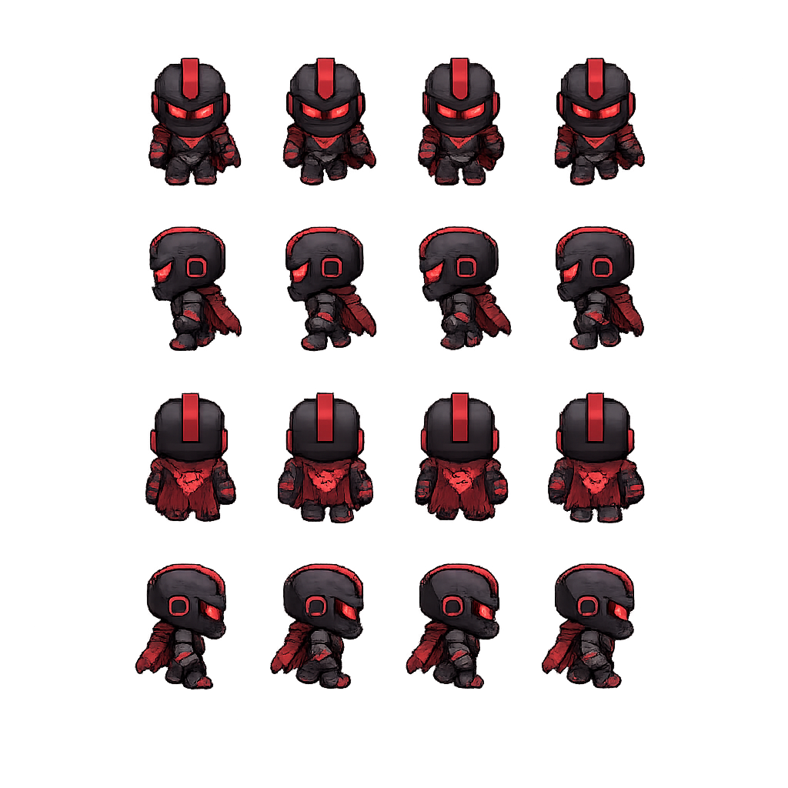

<div align="center">

# QuestFolio

**A browser-based pixel-art RPG that doubles as a developer portfolio.**

[](https://ravikantiakshay.github.io/my-game/)
[](https://github.com/RavikantiAkshay/my-game)

*Walk through a handcrafted world. Enter buildings. Discover a developer's story told through interactive interiors — typewriters, CRT terminals, chalkboards, bookshelves, blueprints, sealed letters, and a travel diary.*

---

</div>

## Overview

QuestFolio is a top-down RPG built entirely in the browser with vanilla HTML, CSS, and JavaScript — no frameworks, no bundlers. You control a character exploring an interconnected world of villages, schools, and castles. Every building you enter is a fully interactive experience: the Lab boots up a CRT monitor with live project demos, the Library lines its shelves with skill books, the Workshop lays out blueprints, the School writes on a chalkboard, and the Post Office delivers a sealed letter.

It's part game, part portfolio, part cinematic experience.

---

## Controls

| Key | Action |
|:---:|:-------|
| `W` `A` `S` `D` / Arrow Keys | Move |
| `E` | Interact with buildings / NPCs |
| `ESC` | Return to overworld |
| `Click` | Attack (3-hit combo) |
| `F` | Defend |
| `N` | Cycle time of day |
| `M` | Cycle season |
| `T` | Open travel diary |

---

## The World

Three interconnected zones, each with its own tileset, collision map, NPCs, and interactable buildings.

**Town** — The starting village. Pine forests, dirt paths, streetlamps.
- **Home** — A log cabin with a typewriter. The page stuck in it is your personal introduction.
- **Lab** — A research facility. Boot up the CRT monitor to browse live project demos with embedded iframes, feature lists, tech stacks, and direct links to GitHub repos and deployed apps. A phone-shaped panel shows "Active Bounties" — gamified calls to action.
- **Workshop** — A blacksmith forge turned drafting table. Flip through blueprints for active projects and stashed concepts (with honest reasons why they were shelved). Decorative rulers, protractors, pencils, and coffee stains on the table.

**School** — A sprawling campus with a bell tower and classrooms.
- **School** — Step inside and face the chalkboard. Slide through an animated education timeline from Class X through B.Tech at IIT Bhilai. Chalk pieces and an eraser sit on the ledge.
- **Library** — A grand hall with two floor-to-ceiling wooden book racks. Six shelves: Languages, Frontend, Backend, Databases, Tools & DevOps, AI & Cloud. Each book spine is a technology.
- **Post Office** — An L-shaped post office. A kraft envelope sits open on the desk — complete with an airmail border, a wax seal stamped "A", a postmark, and a green paperclip. The letter inside has a personal note and a contact directory (Email, Phone, GitHub, LinkedIn).

**Castle** — A dark fortress at the edge of the map. Boss encounter inside.

---

## Interiors

Every building has a hand-crafted pixel-art interior rendered as a 3/4 orthographic cutaway with exterior walls, grass, trees, and furniture. An "Explore" button toggles between viewing the room art and the interactive overlay.

<table>
  <tr>
    <td align="center"><b>Home</b><br></td>
    <td align="center"><b>Lab</b><br></td>
    <td align="center"><b>Workshop</b><br></td>
  </tr>
  <tr>
    <td align="center"><b>School</b><br></td>
    <td align="center"><b>Library</b><br></td>
    <td align="center"><b>Post Office</b><br></td>
  </tr>
</table>

---

## Characters

<table>
  <tr>
    <td align="center" width="33%">
      
      <br><b>The Player</b>
      <br><sub>4-directional animated sprite with idle, walking, and attack frames. 3-hit combo system with defend stance.</sub>
    </td>
    <td align="center" width="33%">
      
      <br><b>AKBOT-E7</b>
      <br><sub>AI companion. Appears in a cinematic intro sequence and narrates each building with contextual speech bubbles.</sub>
    </td>
    <td align="center" width="33%">
      
      <br><b>The Boss</b>
      <br><sub>Castle guardian with custom AI. Advances, retreats, and faces the player directionally. Two-phase attack pattern with dialogue transitions.</sub>
    </td>
  </tr>
</table>

4 additional NPCs placed across zones with directional animation and interaction prompts.

---

## Combat & Boss Fight

- 3-hit combo attack system with directional sprite animations
- Defend stance that blocks incoming damage
- Health bars for both player and enemies
- Screen shake on impact, red hurt flash on damage

**Boss Fight** — A multi-phase encounter in the Castle:
- **Phase 1** — Boss summons ground spikes targeting the player. Warning markers flash before impact. Attack frequency escalates and multiple simultaneous spikes spawn as the fight progresses.
- **Phase 2** — Triggers at 70% HP. Boss delivers dialogue, then switches to fire attacks — horizontal and vertical flame walls forming cross patterns, rendered with fire sprite sheets.

---

## Atmospheric Systems

**Time of Day** — 4-state cycle toggled with `N`:

| Mode | Effect |
|:-----|:-------|
| Day | Clear sky, no overlay |
| Evening | Warm orange-to-purple gradient with gentle breathing pulse |
| Night | Deep darkness with light holes for player lantern, streetlamps, and window lights. Emissive glow cores on sources. |
| Early Morning | Cool pale-blue mist with soft pulsing |

**Seasons** — 4-state cycle toggled with `M`:

| Season | Effect |
|:-------|:-------|
| Summer | Converging god-rays fanning from a sun point with radial fade. World-space positioned — you walk through them. |
| Monsoon | Angled rain, expanding ripple splashes on impact, procedural puddles with specular highlights, gray-blue overcast sky. |
| Autumn | Wind-blown leaf particles with wobble physics. *(Default)* |
| Winter | Dense slow-falling snowflakes with horizontal drift. Frosty white-blue overcast sky. |

---

## Travel Diary

Press `T` to open a page-flippable travel diary. It renders:
- A statistics page — total trips, total days traveled, total distance (Haversine-calculated), unique places, longest/shortest trip, breakdowns by year, month, and transport.
- Individual trip pages — dates, places visited, an interactive Leaflet.js map with route lines, and trip highlights.

---

## Run Locally

No build step required. Just serve the files.

```bash
git clone https://github.com/RavikantiAkshay/my-game.git
cd my-game

python -m http.server 8080    # or npx serve . or VS Code Live Server
```

---

<div align="center">

[](mailto:ravikantiakshay15@gmail.com)
[](https://github.com/RavikantiAkshay)
[](https://linkedin.com/in/ravikanti-akshay)

<sub>Built with vanilla code, pixel art, and an unreasonable amount of CSS.</sub>

</div>
